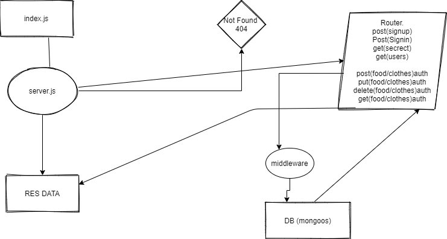

# auth-api
Creating the repo on github.

Add Node CI

install packages

make model

make server

make db functions for the table

make the schema

make router put get post delete

res data from db
TESTING by npm test

*URL's

[Heroku](https://ayoub-lab08.herokuapp.com/)

[Action](https://github.com/ayoubkandah/auth-api/actions/new)

[pull request](https://github.com/ayoubkandah/auth-api/pulls)

wml

